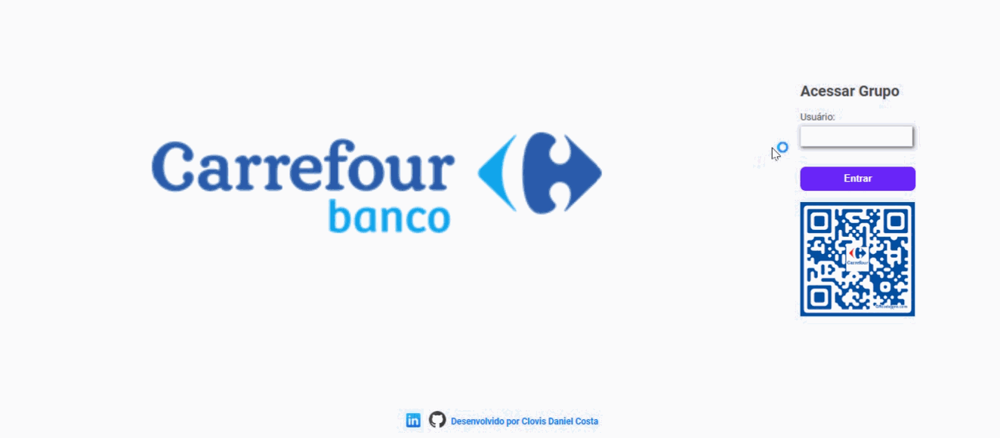

<h1 align="center">
:small_red_triangle_down:  Agenda de Compromissos
</h1>
<h2 align="center">
Curso Python e Django - Desenvolvimento Web e Banco de Dados
</h3>
<h3 align="center">
Bootcamp Global FullStack Developer da Digital Innovation One
</h3>

<p align="center">
  

  
</p>

<p>
O objetivo deste projeto é reproduzir uma agenda customizada a partir do modelo apresentado no curso de Introdução ao Python e Django - Desenvolvimento Web e Banco de Dados da <b>Digital Innovation One</b> aplicando alguns conceitos aprendidos no cursos de HTML5 e CSS3.
</p>

<p align="center">
  <a href="#cloud-deploy">Deploy</a>&nbsp;&nbsp;&nbsp;|&nbsp;&nbsp;&nbsp;
  <a href="#rocket-tecnologias">Tecnologias</a>&nbsp;&nbsp;&nbsp;|&nbsp;&nbsp;&nbsp;
  <a href="#computer-instalando">Instalando</a>&nbsp;&nbsp;&nbsp;|&nbsp;&nbsp;&nbsp;
  <a href="#books-aprendendo">Aprendendo</a>&nbsp;&nbsp;&nbsp;|&nbsp;&nbsp;&nbsp;
  <a href="#small_orange_diamond-contribuindo">Contribuindo</a>&nbsp;&nbsp;&nbsp;|&nbsp;&nbsp;&nbsp;
  <a href="#small_orange_diamond-customizando">Customizando</a>&nbsp;&nbsp;&nbsp;|&nbsp;&nbsp;&nbsp;
  <a href="#small_orange_diamond-licença">Licença</a>
</p>

<p align="center">
  
</p>

## :cloud: Deploy

Foi usado o servidor Heroku para o deploy e pipeline de integração contínua da aplicação. Para testar a aplicação use o usuário "convidado" e senha "user12345" no link abaixo:

[https://python-agenda.herokuapp.com/](https://python-agenda.herokuapp.com/)

## :rocket: Tecnologias

Nesse projeto foram usadas as seguintes tecnologias:

- [Python](https://www.python.org/)
- [Django](https://www.djangoproject.com/)
- [Postgres](https://www.postgresql.org/)
- [Html5](https://developer.mozilla.org/pt-BR/docs/Web/HTML/HTML5)
- [Css3](http://www.linhadecodigo.com.br/artigo/3566/introducao-as-novidades-do-css3.aspx)
- [Sqlalchemy](https://www.sqlalchemy.org/)
- [Flask](https://flask.palletsprojects.com/en/1.1.x/)

## :computer: Instalando

1. É requisito necessário ter instalados na máquina Python, Django e Postgres.

2. Faça o clone deste repositório numa pasta desejada: 

    `$ git clone -b localhost https://github.com/clovisdanielcosta/python-agenda.git`

3. Entre na pasta do app:

    `$ cd python-agenda`

4. Rode este comando para instalar as dependências:
  
    `$ pip install -r requirements.txt`

5. Rode este comando para efetuar as migrations:
  
    `$ python manage.py migrate`

6. Rode este comando para criar o super usuário:
  
    `$ python manage.py createsuperuser --username admin`

7. Rode este comando para subir o servidor:
  
    `$ python manage.py runserver`

8. Digite o comando abaixo na barra de endereço de um navegador e crie um usuário:
  
    `localhost:8000/admin`

9. Digite o comando abaixo na barra de endereço de um navegador para logar no sistema:
  
    `localhost:8000/`

## :books: Aprendendo

- Entendendo como usar o Flask para tornar o desenvolvimento mais simples.
- Autenticação de usuário no Django.
- Criação de rotas para views personalizadas.
- Uso de arquivos estáticos no Django.

## :small_orange_diamond: Contribuindo

1. Para que o Django localize seus arquivos estáticos, por exemplo de imagens ou estilos, deverá criar um diretório dentro do projeto chamado "static" e colocar estes arquivos dentro desta pasta. Depois disto basta fazer as referências deles dentro dos templates das seguintes formas:

```python

    

    <link rel="stylesheet" href="?version=1">

```
2. Para saber mais sobre a migração de Sqlite para Postgres acesse o link abaixo:

    [https://www.youtube.com/watch?v=ZgRkGfoy2nE](https://www.youtube.com/watch?v=ZgRkGfoy2nE)

3. Para entender melhor como fazer o deploy de aplicações em Python com Django no Heroku acesse o link abaixo:

    [https://www.youtube.com/watch?v=wsi0xpHUM00](https://www.youtube.com/watch?v=wsi0xpHUM00)

## :small_orange_diamond: Customizando

1. O projeto original era focado no backend e foi feita a estilização do frontend.
2. Criaçao da Logo do app.
3. Adição de campo na tabela evento para incluir o local do evento.
4. Inclusão de Consulta  Eventos Passados e Todos os Eventos.
5. Criada função para Exportar Dados em formato JSON.
6. Migração do banco de dados de Sqlite para Postgres.

## :small_orange_diamond: Licença

Esse projeto está sob a licença MIT. Veja o arquivo [LICENSE](LICENSE.md) para mais detalhes.
A(s) imagem(s) usada(s) neste projeto são originais do autor ou foram obtidas através de sites de terceiros com a devida autorização para uso gratuito.

## :small_orange_diamond: Agradecimentos

Quero agradecer a <b>Digital Innovation One</b> e parabenizar o Rafael Galleani pelo excelente ensino durante as aulas. 
Parabéns, vocês estão fazendo um ótimo trabalho em favor da sociedade! 

Muito obrigado! :clap::clap:

